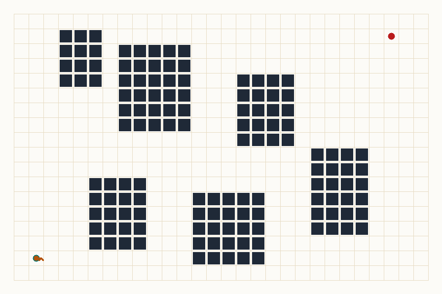
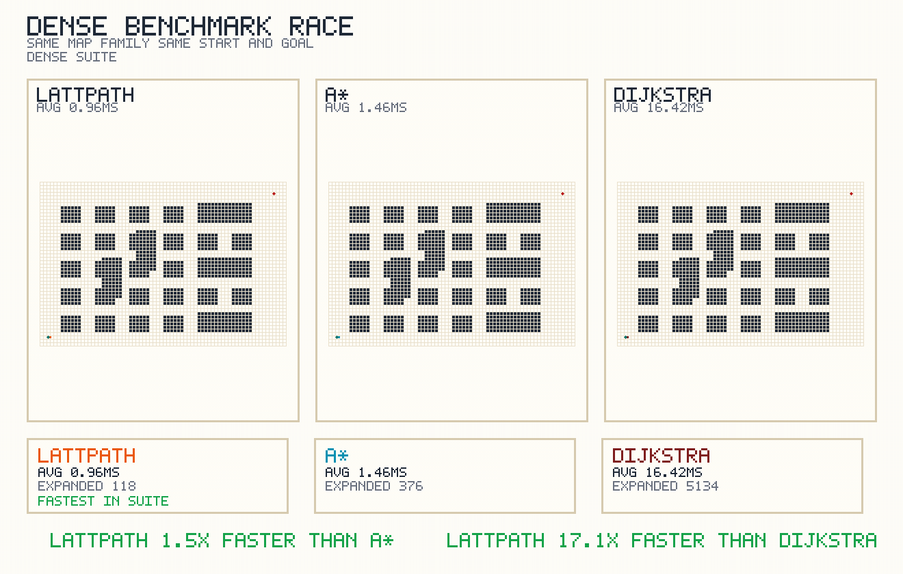
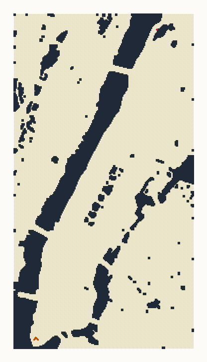
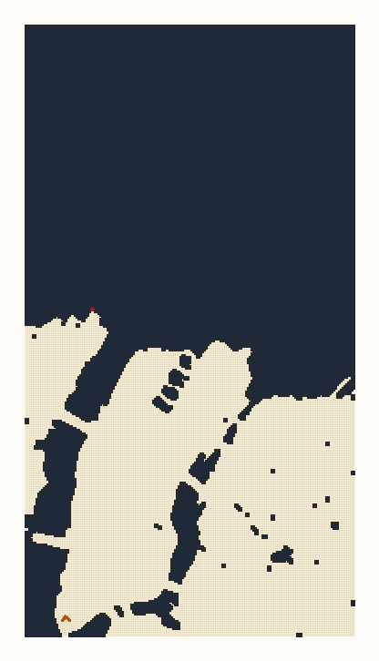
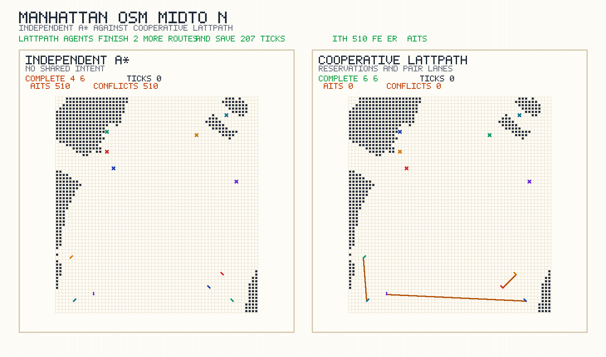

# LattPath

Portable state-lattice path planning demo with a built-in visualizer, a dense-environment benchmark, and generated walkthrough media.



[MP4 version](assets/lattpath_demo.mp4) · [Static SVG](assets/lattpath_demo.svg)

## What this repo is now

`LattPath` now ships as a small, runnable path-planning project instead of a non-portable Visual Studio snapshot:

- C++17 state-lattice planner over `(x, y, heading)` states
- Heading-aware motion primitives: `forward`, `long_forward`, `cruise_forward`, `left_arc`, and `right_arc`
- Dense benchmark suite comparing LattPath against A* and Dijkstra
- Built-in demo scenarios with structured JSON output
- Config-driven city builder that turns OpenStreetMap road networks into route and district scenarios
- Generic city pipeline entrypoints for building, simulating, and rendering additional cities
- Browser visualizer at [`visualizer/index.html`](visualizer/index.html)
- Manhattan coordination viewer at [`visualizer/manhattan.html`](visualizer/manhattan.html)
- SVG, GIF, and MP4 rendering pipeline for README-ready media

The original prototype files are still present under `LatticeDstarPathplanning/` as legacy reference material, but the supported entrypoint for the repo is the new planner in `src/`.

## Quick start

Build the planner:

```bash
cmake -S . -B build
cmake --build build
```

List the bundled scenarios:

```bash
./build/lattpath --list-scenarios
```

List the bundled algorithms:

```bash
./build/lattpath --list-algorithms
```

Generate a sample plan:

```bash
./build/lattpath --scenario downtown --output artifacts/downtown_plan.json
```

That writes a JSON file containing:

- the grid dimensions
- the obstacle cells
- every expanded search state
- the recovered path states and traversed cells
- summary stats such as search cost and runtime

## Visualize a plan

Open `visualizer/index.html` in a browser for single-route plans.

The page includes a bundled downtown demo and also lets you load any planner JSON file with the file picker.

Open `visualizer/manhattan.html` to compare the Midtown multi-agent race between independent `A*` cars and cooperative `LattPath` agents.

You can also regenerate the static and animated media from the command line:

```bash
python3 tools/visualize_plan.py artifacts/downtown_plan.json --still-output assets/lattpath_demo.svg --video-output assets/lattpath_demo.gif
python3 tools/visualize_plan.py artifacts/downtown_plan.json --video-output assets/lattpath_demo.mp4
```

`ffmpeg` is required for video output.

## Dense benchmark



[MP4 version](assets/lattpath_dense_benchmark.mp4) · [Benchmark JSON](artifacts/dense_suite_benchmark.json)

The benchmark video above uses the bundled dense suite:

- `warehouse`
- `switchbacks`
- `dense_city`

Averaged over `250` runs per scenario from the committed benchmark JSON:

- `LattPath`: `0.96 ms` mean runtime, `118` mean expanded states
- `A*`: `1.46 ms` mean runtime, `376` mean expanded states
- `Dijkstra`: `16.42 ms` mean runtime, `5,134` mean expanded states

On this dense suite, `LattPath` comes out about `1.5x` faster than `A*` and `17.1x` faster than `Dijkstra`.

This comparison uses the same start and goal pairs and the same heading-aware state space. The difference is that `LattPath` can use longer macro motion primitives like `long_forward` and `cruise_forward`, while the `A*` and `Dijkstra` baselines are limited to stepwise primitives.

Regenerate the benchmark JSON and benchmark video with:

```bash
./build/lattpath --benchmark-dense-suite --benchmark-iterations 250 --benchmark-output artifacts/dense_suite_benchmark.json
python3 tools/render_benchmark_video.py artifacts/dense_suite_benchmark.json --scenario dense_city --video-output assets/lattpath_dense_benchmark.gif
python3 tools/render_benchmark_video.py artifacts/dense_suite_benchmark.json --scenario dense_city --video-output assets/lattpath_dense_benchmark.mp4
```

## Manhattan backends

The repo now ships two Manhattan build modes over the same city config:

- `custom`: a lightweight non-OSMnx path that rasterizes driving geometry from cached OpenStreetMap XML or a local `.osm.pbf`
- `osmnx`: an OSMnx-backed path that first builds a directed street graph, imputes edge speeds/travel times, then rasterizes that graph into the planner format

Both modes still end in the same lattice-planner input format, but they reach it through different ingestion paths. In the current committed Manhattan artifacts, the cached-XML `custom` path and the `osmnx` path now produce almost the same full-route raster, so the backend comparison is more about reproducible build plumbing than about radically different planner input on this slice.

### Route demo



[Custom MP4](assets/manhattan_osm_custom_lattpath.mp4) · [Custom SVG](assets/manhattan_osm_custom_lattpath.svg) · [Custom grid](artifacts/manhattan_osm_custom_grid.txt)

On the committed full-Manhattan route with the `custom` backend:

- `LattPath`: `79.47 ms`, `9,459` expanded states, `149.95` path cost
- `A*`: `74.41 ms`, `14,426` expanded states, `172.6` path cost

On this current cached-XML build, `LattPath` still expands fewer states, but the runtime difference is small and noisy rather than a dramatic win.



[OSMnx MP4](assets/manhattan_osm_osmnx_lattpath.mp4) · [OSMnx SVG](assets/manhattan_osm_osmnx_lattpath.svg) · [OSMnx grid](artifacts/manhattan_osm_osmnx_grid.txt)

On the same route with the `osmnx` backend:

- `LattPath`: `54.50 ms`, `9,459` expanded states, `149.95` path cost
- `A*`: `53.50 ms`, `14,426` expanded states, `172.6` path cost

So on the current Manhattan route, the important takeaway is not a huge backend split. It is that both ingestion paths now land on nearly the same search problem, and on that problem `LattPath` still trims state expansions but not by enough to guarantee a runtime win.

### Coordination demo


[Custom MP4](assets/manhattan_custom_coordination_race.mp4) · [Custom independent JSON](artifacts/manhattan_custom_independent_astar_simulation.json) · [Custom cooperative JSON](artifacts/manhattan_custom_cooperative_lattpath_simulation.json)



[OSMnx MP4](assets/manhattan_osmnx_coordination_race.mp4) · [OSMnx independent JSON](artifacts/manhattan_osmnx_independent_astar_simulation.json) · [OSMnx cooperative JSON](artifacts/manhattan_osmnx_cooperative_lattpath_simulation.json)

The second Manhattan demo uses a `61 x 65` Midtown slice and six vehicles. In both backends, the simulation now carries forward directional street information and per-cell free-flow speed estimates, and it overlays traffic lights, stop-sign holds, acceleration-limited move timing, sensor-caution delays, and a simple human-driver reaction model on top of the same street raster.

On the committed Midtown race, both backends now converge to the same higher-fidelity pattern:

- Independent `A*`: `6/6` agents finished in `268` ticks with about `896` wait events and at most `1` conflict
- Cooperative `LattPath`: `6/6` agents finished in `134` ticks with about `300` wait events and `0` conflicts

That is the behavior shown in `visualizer/manhattan.html` and in the backend videos above: once signals, stop holds, and reaction delays exist, the independent cars do eventually make it through, but they spend much more time yielding and hesitating. The communication-aware planner still clears the same street slice in roughly half the ticks while eliminating execution-time conflicts.

## A* vs LattPath

`A*` is a search strategy. It explores a graph by combining the path cost so far with a heuristic estimate of the remaining distance. If you give `A*` a graph made of short, local driving moves, it will solve the problem one short move at a time.

`LattPath` in this repo is a state-lattice planner. It still performs graph search, but the graph itself is different: the edges are reusable motion primitives that already encode feasible vehicle behavior and multiple spatial scales such as `forward`, `long_forward`, `cruise_forward`, `left_arc`, and `right_arc`. That means the planner can advance through the map with bigger, heading-aware moves instead of reconstructing the same longer motion from many tiny steps.

So the difference is not that `A*` is "bad" and `LattPath` is "magic." `A*` is the generic search method. `LattPath` is the richer motion model used in this project. In the Manhattan demos, that richer lattice can give the search fewer states to expand, but the size of the runtime win depends strongly on how the street graph is modeled. In the Midtown multi-agent demo, the cooperative `LattPath` variant also adds shared reservations and lane-pair preferences, which independent `A*` cars simply do not use.

## Simulation fidelity

This repo is now closer to a street-network traffic simulation than it was before, but it is still intentionally lightweight:

- It now preserves directed street flow from OpenStreetMap when building the Midtown multi-agent scenario.
- It now carries free-flow road-speed estimates from OpenStreetMap into the city network files so route selection is not purely uniform-grid cost.
- It now has both a `custom` backend and an `osmnx` backend, so backend choice itself can be tested instead of assumed away.
- It now overlays traffic lights, stop-sign holds, acceleration-limited move timing, sensor-caution delays, and a simple human-driver reaction model through generated district control files.
- It now chooses agent headings from locally allowed road directions rather than forcing every car to spawn with the same orientation.
- It now forms communication pairs from overlapping routes instead of from Manhattan-specific coordinate sorting.
- It now uses generic city entrypoints plus a city config file in [`configs/cities/manhattan.json`](configs/cities/manhattan.json), so another city can be added by supplying a new bounding box, route, and district-agent definition.

It still does not model lane-level signal phasing, perception stacks, stochastic human behavior, or continuous vehicle dynamics. The cooperative scheduler also still runs in discrete cell-time ticks rather than continuous traffic time. So the right description is: an OSM-grounded, direction-aware, control-aware coordination simulation, not a full autonomous-vehicle stack.

## Rebuild a city demo

The repo includes a generic helper script:

```bash
LATTPATH_CITY_CONFIG=configs/cities/manhattan.json \
LATTPATH_CITY_BACKEND=custom \
LATTPATH_OUTPUT_TAG=custom \
tools/generate_city_demo.sh
```

If you already have a local `.osm.pbf` extract and a local `pyrosm` environment, you can point the script at the faster path:

```bash
LATTPATH_CUSTOM_PYTHONPATH=/path/to/custom/site-packages \
LATTPATH_CITY_PBF=/path/to/city.osm.pbf \
LATTPATH_CITY_CONFIG=configs/cities/manhattan.json \
LATTPATH_CITY_BACKEND=custom \
LATTPATH_OUTPUT_TAG=custom \
bash tools/generate_city_demo.sh
```

To build the OSMnx variant instead:

```bash
LATTPATH_OSMNX_PYTHONPATH=/path/to/osmnx/site-packages \
LATTPATH_CITY_CONFIG=configs/cities/manhattan.json \
LATTPATH_CITY_BACKEND=osmnx \
LATTPATH_OUTPUT_TAG=osmnx \
bash tools/generate_city_demo.sh
```

To generate both backends back to back:

```bash
bash tools/generate_city_backend_comparison.sh
```

The Manhattan-specific wrapper still exists for convenience, but the generic backend-aware script is the recommended path:

```bash
LATTPATH_MANHATTAN_PBF=/path/to/NewYork.osm.pbf bash tools/generate_manhattan_demo.sh
```

To add another city, copy [`configs/cities/manhattan.json`](configs/cities/manhattan.json), follow the schema in [`configs/cities/README.md`](configs/cities/README.md), change the city bounding box and district agent seeds, and run the same builder/simulator pipeline against that new config.

## Repo layout

- `src/` and `include/`: portable planner implementation and CLI
- `visualizer/`: standalone HTML viewers for single plans and Manhattan coordination
- `tools/visualize_plan.py`: SVG and video renderer
- `tools/render_benchmark_video.py`: dense-suite comparison video renderer
- `tools/render_city_race.py`: generic multi-agent city race renderer
- `tools/render_manhattan_race.py`: Manhattan compatibility wrapper for the city race renderer
- `tools/build_city_osm.py`: generic city builder with `custom` and `osmnx` backends
- `tools/build_manhattan_osm.py`: legacy/custom OpenStreetMap builder module retained for compatibility
- `tools/simulate_city_agents.py`: generic multi-agent city simulator
- `tools/simulate_manhattan_agents.py`: Manhattan compatibility wrapper for the city simulator
- `tools/generate_city_demo.sh`: reproducible city demo pipeline
- `tools/generate_city_backend_comparison.sh`: runs the `custom` and `osmnx` city demos side by side
- `tools/generate_manhattan_demo.sh`: Manhattan convenience wrapper
- `configs/cities/`: reusable city definitions for route and district scenarios
- `artifacts/*_controls.json`: generated traffic-control and behavior overlays for district simulations
- `artifacts/`: sample planner outputs committed to the repo
- `assets/`: generated media used by this README
- `LatticeDstarPathplanning/`: legacy prototype snapshot

## Validation

The planner is covered by the CMake smoke tests:

```bash
ctest --test-dir build --output-on-failure
```

The committed sample outputs were generated from:

- `downtown`
- `warehouse`
- `switchbacks`
