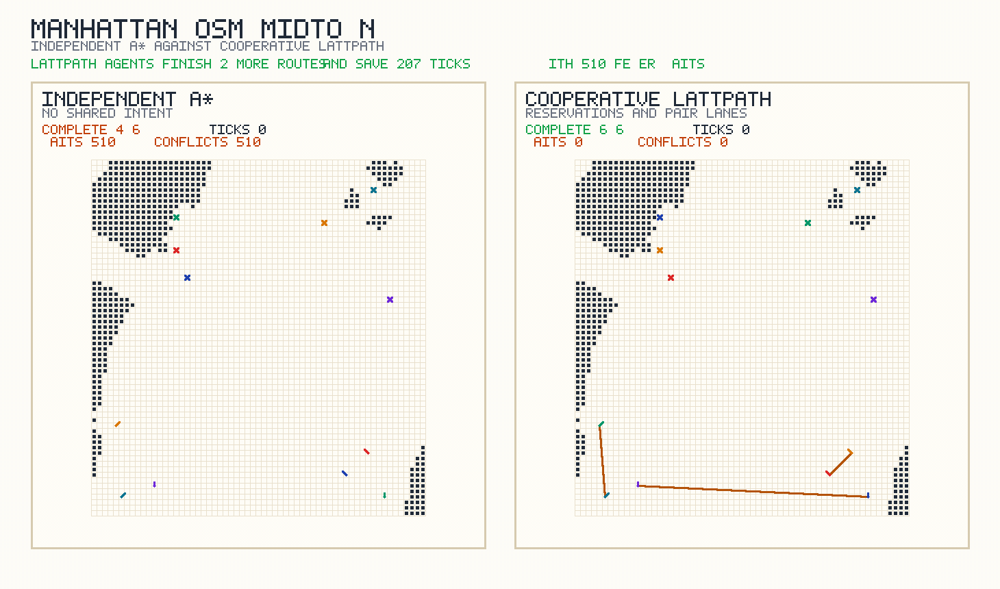

# LattPath

Portable state-lattice path planning demo with a built-in visualizer, a dense-environment benchmark, and generated walkthrough media.


[MP4 version](assets/lattpath_demo.mp4) · [Static SVG](assets/lattpath_demo.svg)

## What this repo is now

`LattPath` now ships as a small, runnable path-planning project instead of a non-portable Visual Studio snapshot:

- C++17 state-lattice planner over `(x, y, heading)` states
- Heading-aware motion primitives: `forward`, `long_forward`, `cruise_forward`, `left_arc`, and `right_arc`
- Dense benchmark suite comparing LattPath against A* and Dijkstra
- Built-in demo scenarios with structured JSON output
- Browser visualizer at [`visualizer/index.html`](visualizer/index.html)
- Manhattan coordination viewer at [`visualizer/manhattan.html`](visualizer/manhattan.html)
- SVG, GIF, and MP4 rendering pipeline for README-ready media

The original prototype files are still present under `LatticeDstarPathplanning/` as legacy reference material, but the supported entrypoint for the repo is the new planner in `src/`.

## Quick start

Build the planner:

```bash
cmake -S . -B build
cmake --build build
```

List the bundled scenarios:

```bash
./build/lattpath --list-scenarios
```

List the bundled algorithms:

```bash
./build/lattpath --list-algorithms
```

Generate a sample plan:

```bash
./build/lattpath --scenario downtown --output artifacts/downtown_plan.json
```

That writes a JSON file containing:

- the grid dimensions
- the obstacle cells
- every expanded search state
- the recovered path states and traversed cells
- summary stats such as search cost and runtime

## Visualize a plan

Open `visualizer/index.html` in a browser for single-route plans.

The page includes a bundled downtown demo and also lets you load any planner JSON file with the file picker.

Open `visualizer/manhattan.html` to compare the Midtown multi-agent race between independent `A*` cars and cooperative `LattPath` agents.

You can also regenerate the static and animated media from the command line:

```bash
python3 tools/visualize_plan.py artifacts/downtown_plan.json --still-output assets/lattpath_demo.svg --video-output assets/lattpath_demo.gif
python3 tools/visualize_plan.py artifacts/downtown_plan.json --video-output assets/lattpath_demo.mp4
```

`ffmpeg` is required for video output.

## Dense benchmark


[MP4 version](assets/lattpath_dense_benchmark.mp4) · [Benchmark JSON](artifacts/dense_suite_benchmark.json)

The benchmark video above uses the bundled dense suite:

- `warehouse`
- `switchbacks`
- `dense_city`

Averaged over `250` runs per scenario from the committed benchmark JSON:

- `LattPath`: `0.96 ms` mean runtime, `118` mean expanded states
- `A*`: `1.46 ms` mean runtime, `376` mean expanded states
- `Dijkstra`: `16.42 ms` mean runtime, `5,134` mean expanded states

On this dense suite, `LattPath` comes out about `1.5x` faster than `A*` and `17.1x` faster than `Dijkstra`.

This comparison uses the same start and goal pairs and the same heading-aware state space. The difference is that `LattPath` can use longer macro motion primitives like `long_forward` and `cruise_forward`, while the `A*` and `Dijkstra` baselines are limited to stepwise primitives.

Regenerate the benchmark JSON and benchmark video with:

```bash
./build/lattpath --benchmark-dense-suite --benchmark-iterations 250 --benchmark-output artifacts/dense_suite_benchmark.json
python3 tools/render_benchmark_video.py artifacts/dense_suite_benchmark.json --scenario dense_city --video-output assets/lattpath_dense_benchmark.gif
python3 tools/render_benchmark_video.py artifacts/dense_suite_benchmark.json --scenario dense_city --video-output assets/lattpath_dense_benchmark.mp4
```

## Manhattan OSM route


[MP4 version](assets/manhattan_osm_lattpath.mp4) · [Static SVG](assets/manhattan_osm_lattpath.svg) · [Scenario grid](artifacts/manhattan_osm_grid.txt)

The repo now also ships a real Manhattan street raster generated from OpenStreetMap road geometry. The committed `manhattan_osm` scenario covers a `180 x 335` slice of Manhattan from Battery Park toward Inwood, with the roads rasterized into the same heading-aware planner format as the toy demos.

On that full Manhattan route:

- `LattPath`: `9.53 ms`, `485` expanded states, `262.05` path cost
- `A*`: `51.18 ms`, `15,660` expanded states, `313.0` path cost

In this implementation, `LattPath` reaches the Manhattan goal about `5.4x` faster than the `A*` baseline and with about `32.3x` fewer state expansions.

## Manhattan coordination



[MP4 version](assets/manhattan_coordination_race.mp4) · [Independent A* JSON](artifacts/manhattan_independent_astar_simulation.json) · [Cooperative LattPath JSON](artifacts/manhattan_cooperative_lattpath_simulation.json)

The second Manhattan demo uses a `61 x 65` Midtown slice and six vehicles. The independent baseline plans each car with `A*` and lets them discover conflicts only at execution time. The cooperative `LattPath` variant shares spacetime reservations between agents and nudges paired cars into adjacent lanes so they can move as a small lattice instead of six isolated planners.

On the committed Midtown race:

- Independent `A*`: `4/6` agents finished within `260` ticks, `472` waits, `472` conflicts
- Cooperative `LattPath`: `6/6` agents finished in `56` ticks, `1` wait, `0` conflicts

That is the behavior shown in `visualizer/manhattan.html` and in the README video above: the communication-aware planner clears the same street slice with full completion, far fewer stalls, and stable side-by-side formations.

## A* vs LattPath

`A*` is a search strategy. It explores a graph by combining the path cost so far with a heuristic estimate of the remaining distance. If you give `A*` a graph made of short, local driving moves, it will solve the problem one short move at a time.

`LattPath` in this repo is a state-lattice planner. It still performs graph search, but the graph itself is different: the edges are reusable motion primitives that already encode feasible vehicle behavior and multiple spatial scales such as `forward`, `long_forward`, `cruise_forward`, `left_arc`, and `right_arc`. That means the planner can advance through the map with bigger, heading-aware moves instead of reconstructing the same longer motion from many tiny steps.

So the difference is not that `A*` is "bad" and `LattPath` is "magic." `A*` is the generic search method. `LattPath` is the richer motion model used in this project. In the Manhattan demo, that richer lattice gives the search far fewer states to expand. In the Midtown multi-agent demo, the cooperative `LattPath` variant also adds shared reservations and lane-pair preferences, which independent `A*` cars simply do not use.

## Rebuild the Manhattan demo

The repo includes a helper script:

```bash
tools/generate_manhattan_demo.sh
```

By default it rebuilds the Manhattan assets from live OpenStreetMap tiles. If you already have a local `.osm.pbf` extract and a local `pyrosm` environment, you can point the script at the faster path:

```bash
LATTPATH_PYTHONPATH=/path/to/site-packages \
LATTPATH_MANHATTAN_PBF=/path/to/NewYork.osm.pbf \
tools/generate_manhattan_demo.sh
```

## Repo layout

- `src/` and `include/`: portable planner implementation and CLI
- `visualizer/`: standalone HTML viewers for single plans and Manhattan coordination
- `tools/visualize_plan.py`: SVG and video renderer
- `tools/render_benchmark_video.py`: dense-suite comparison video renderer
- `tools/render_manhattan_race.py`: Manhattan multi-agent race renderer
- `tools/build_manhattan_osm.py`: OpenStreetMap-to-grid builder for Manhattan
- `tools/generate_manhattan_demo.sh`: reproducible Manhattan demo pipeline
- `artifacts/`: sample planner outputs committed to the repo
- `assets/`: generated media used by this README
- `LatticeDstarPathplanning/`: legacy prototype snapshot

## Validation

The planner is covered by the CMake smoke tests:

```bash
ctest --test-dir build --output-on-failure
```

The committed sample outputs were generated from:

- `downtown`
- `warehouse`
- `switchbacks`
